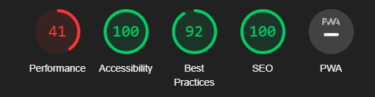

# Project-Portfolio 2
# XOX Winners - Tic Tac Toe Game

## Overview

XOX Winners is a classic Tic-Tac-Toe game with an exciting twist.
It offers a variety of game types as well as the chance to compete against a computer opponent while still allowing players to enjoy the classic action. To win the game, you must line up three markers in a row, whether they are placed vertically, horizontally, or diagonally.

### Link to the final page
- [xox-winners](https://atchutchi.github.io/xox-winners/)

## Table of Contents
- Overview
- Features
- Testing
- Validator Testing
- Deployment
- Credits

## Features

### Navigation Bar

The navigation bar in the game has a minimalistic appearance. It comprises of a logo that can be clicked on to navigate to the home page.

### Landing Page

The landing page of the XOX Winners game provides a seamless entry into the gameplay experience. 
Users are welcomed with the game's visually beautiful and user-friendly interface when they launch it. Players can pick between "Player vs. Player" and "Player vs. Machine" on the landing page, which acts as their starting point.

### Game Board

### Game Board Phone

#### Player vs. Player: 
- Play against another player on the same device and take turns making moves.

#### Player vs. Machine: 
- Challenge the computer opponent in a one-on-one match. Test your skills against an AI that makes strategic moves.

#### Dynamic Game Board: 
- The game board adjusts to fit different screen sizes, providing a responsive and enjoyable gaming experience on various devices.

#### Score Tracking: 
- Keep track of the scores for each player (Player X and Player O) as the game progresses through multiple rounds.

#### Game Restart: 
- Restart the game at any time with a click of the "Restart" button to start a fresh match.

### Rules

### Rules Phone

The game has a rules section that describes how the game works and its rules so as to facilitate players to have a more competitive and fun game.

### Footer

The site has a footer with the description of the copyrights

## Testing

### Bugs and Solutions
The site was not difficult to create, although I had a lot of difficulties in making a flow that would facilitate the development of the game, after a lot of research I found these two links (https://codepen.io/lando464/pen/BPGEKO) and (https://codepen.io/janschreiber/pen/xZbEvM) from the game where I inspired to create the board and the javaScript code.

1. **Problem:** No game logic implemented
- **Description:** Initially, the project lacked the necessary game logic for handling player moves, win detection, and round tracking.
- **Solution:** Implemented the game logic by adding event listeners to each cell for player moves, creating an array to store the board state, and implementing win detection using predefined winning combinations.
- **Commit:** [Link to related commit](https://github.com/atchutchi/xox-winners/commit/89cea70cb98bfe9c4bff84ec49b68359dddd26f2)

2. **Problem:** No Restart Functionality
- **Description:** The game lacked a restart functionality to reset the game state and scores.
- **Solution:** Added an event listener to the restart button, which reloads the page to restart the game.
- **Commit:** [Link to related commit](https://github.com/atchutchi/xox-winners/commit/4849fbdb09931a2ca03241906bb63b6d817c87b6)

3. **Problem:** Computer decision did not consider winning
- **Description:** computer's decision-making process for selecting a move. Specifically, the previous implementation of computerMove() did not consider winning moves for the computer.
- **Solution:** Create a for with winningCombination by following this [code](https://codepen.io/janschreiber/pen/xZbEvM)
- **Commit:** [Link to related commit](https://github.com/atchutchi/xox-winners/commit/6f23323aa256dfb2138659c873bb38d15acbbb6a)

4. **Problem:** Game wouldn't restart in player vs machine mode after 5 rounds
- **Description:** The game always continues after 5 rounds, sometimes it freezes and does not continue and does not reset the game board
- **Solution:** I went to the endGame function and changed if playerScores >=5 to announce the winner and start nextRound. then I removed the if condition (currentRound === totalRounds) and called endGame() in the handleCellClick(event) function and computerMove() function.
- **Commit 1:** [Link to related commit](https://github.com/atchutchi/xox-winners/commit/2875c5534c8e15758557b5b37bb5217818cdd021)
- **Commit 2:** [Link to related commit](https://github.com/atchutchi/xox-winners/commit/122355cd8b09740753386ea9c80b7879ccbb5a15)

5. **Problem:** After I play, I can play before the machine makes its move
- **Description:** In the game's "Player vs Machine" mode, the player had the ability to make a move during the machine's turn. This was because the click event on board cells was not disabled during machine play, allowing the player to interact with the board and make a move.
- **Solution:** The solution to this problem involved removing the click event from all cells when it is the machine's turn to move, and adding it back after the machine has made its move. This has been implemented in the handleCellClick, computerMove and startNextRound functions. Now, the player can only interact with the board when it's their turn, preventing them from making a move during the machine's turn.
- **Commit:** [Link to related commit](https://github.com/atchutchi/xox-winners/commit/af836f3ad7992ed94e36ce42659593c52f8a9e28)

### Future Developments
- Add sound effect when computer and player make their moves;
- Add difficulties in the game (Easy, Medium and Difficult);

### Responsivity
The subsequent web browsers were utilized to evaluate the website's compatibility and consistent appearance. Comprehensive responsiveness tests were conducted, and the results indicated satisfactory performance across these platforms, ensuring a seamless user experience.

#### Chrome
- [Desktop](./assets/images/chrome-desktop.png)
- [Laptop](./assets/images/chrome-laptop.png)
- [Tablet](./assets/images/chrome-tablet.png)
- [Smartphone](./assets/images/chrome-smartphone.png)

#### Edge
- [Desktop](./assets/images/edge-desktop.png)
- [Laptop](./assets/images/edge-laptop.png)
- [Tablet](./assets/images/edge-tablet.png)
- [Smartphone](./assets/images/edge-smartphone.png)

#### Firefox
- [Desktop](./assets/images/firefox-desktop.png)
- [Laptop](./assets/images/firefox-laptop.png)
- [Tablet](./assets/images/firefox-tablet.png)
- [Smartphone](./assets/images/firefox-smartphone.png)

### Validator Testing

#### HTML
by running the test at [Validator w3 html](https://validator.w3.org/) Document checking completed. No errors or warnings to show

#### CSS
by running the test at [Jigsaw w3 css/](https://jigsaw.w3.org/css-validator/)
W3C CSS Validation Results for TextArea (CSS Level 3 + SVG)
No errors were found in your stylesheet.

#### JavaScript
The code was tested on [jshint](https://jshint.com/)
Without errors

#### Accessibility
- I confirmed that colors and fonts chosen are easy to read and accessible by running it through lightouse in chrome devtools

## Deployment
The site was deployed to GitHub pages. The steps to deploy are as follows:
- Log in to your GitHub account and go to the main page of your repository.
- Click on the "Settings" tab at the top of the repository page.
- Scroll down to the "GitHub Pages" section.
- In the "Source" drop-down menu, select "main" or "master" (depending on your setup) and choose the "root" or "docs" folder if you are using a specific folder to host your site.
- Click on "Save."
- The page will refresh, and after a few moments, you will see a message stating that the deployment was successful. The live link to your site will be provided just below this message.

## Credits

### Content

- The text for the "XOX Winners" project was inspired on my knowledge and this [Link](https://www.bigmae.com/regras-jogo-da-velha/).
- The font of the text was used [googlefonts](https://fonts.google.com/).

### Media
- The logo of the project was created by me.
- Screenshot of the responsive where taken from [ui.dev](https://ui.dev/amiresponsive?url=https://atchutchi.github.io/xox-winners/).
- To create Skeleton of the project it was used the Balsamiq [wireframe](https://balsamiq.cloud/skteh5n/pz7ucs).

### Language Used
- HTML5
- CSS
- JAVASCRIPT

### Codes
- The code was inspired by these 2 versions [lando464](https://codepen.io/lando464/pen/BPGEKO) & [janschreiber](https://codepen.io/janschreiber/pen/xZbEvM)
- I used [codeanywhere](https://app.codeanywhere.com/) for the development of the project as a whole.
- Assistance with HTML, CSS was provided by [Developer Mozilla](https://developer.mozilla.org/) [CSS-tricks](https://css-tricks.com/), [TikTok](https://www.tiktok.com/@thewebforce/video/7233395940181183745?_t=8cYUmROW3SH&_r=1).
- Tutorials and documentation from Code Institute Love Math and youtube [video](https://www.youtube.com/watch?v=lhNdUVh3qCc&t=14s).
- [My Mentor Can Sücüllü] were consulted during the development process.
