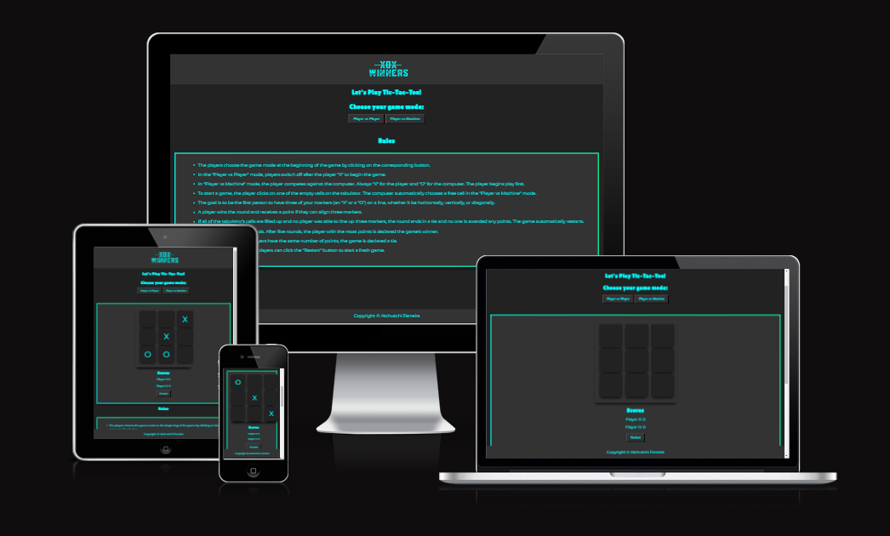

# Project-Portfolio 2
# XOX Winners - Tic Tac Toe Game

## Overview

XOX Winners is a classic Tic-Tac-Toe game with an exciting twist.
It offers a variety of game types as well as the chance to compete against a computer opponent while still allowing players to enjoy the classic action. To win the game, you must line up three markers in a row, whether they are placed vertically, horizontally, or diagonally.

## Table of Contents
- Overview
- Features
- Testing
- Validator Testing
- Deployment
- Credits

## Features

The navigation bar in the game has a minimalistic appearance. It comprises of a logo that can be clicked on to navigate to the home page.

The landing page of the XOX Winners game provides a seamless entry into the gameplay experience. 
Users are welcomed with the game's visually beautiful and user-friendly interface when they launch it. Players can pick between "Player vs. Player" and "Player vs. Machine" on the landing page, which acts as their starting point.

### Player vs. Player: 
- Play against another player on the same device and take turns making moves.

### Player vs. Machine: 
- Challenge the computer opponent in a one-on-one match. Test your skills against an AI that makes strategic moves.

### Dynamic Game Board: 
- The game board adjusts to fit different screen sizes, providing a responsive and enjoyable gaming experience on various devices.

### Score Tracking: 
- Keep track of the scores for each player (Player X and Player O) as the game progresses through multiple rounds.

### Game Restart: 
- Restart the game at any time with a click of the "Restart" button to start a fresh match.

The game has a rules section that describes how the game works and its rules so as to facilitate players to have a more competitive and fun game.

The site has a footer with the description of the copyrights

## Testing

### Bugs and Solutions

